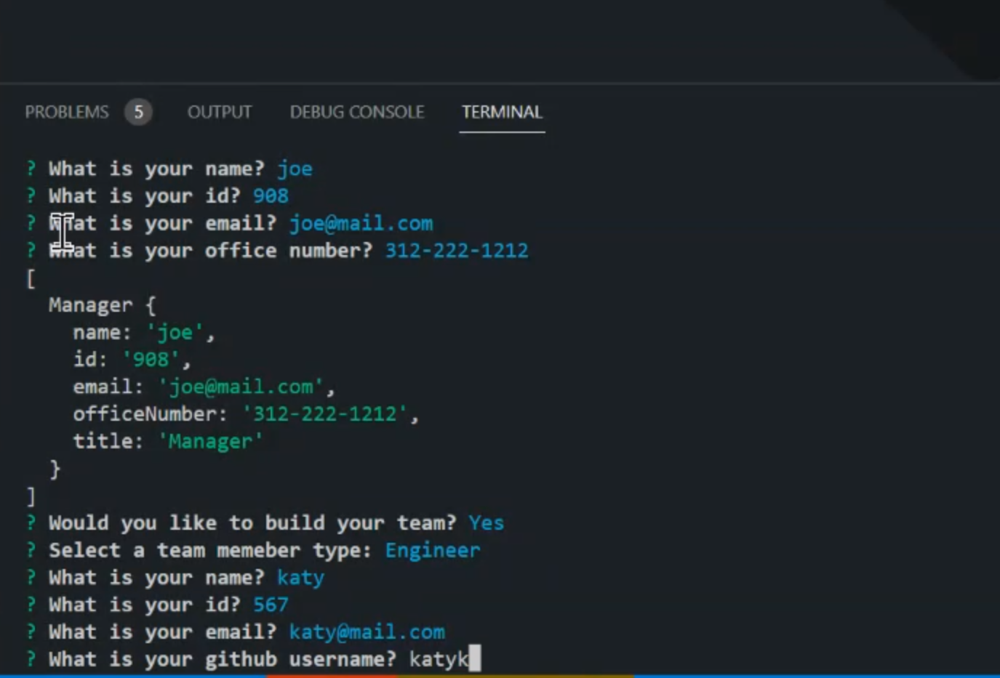

# bookish-sniffle

    [](https://github.com/prettier/prettier) [](code_of_conduct.md)

## Table of Contents

If your README is long, add a table of contents to make it easy for users to find what they need.

- [Description](#description)
- [Installation](#installation)
- [Mock-Up](#mock-up)
- [Usage](#usage)
- [License](#license)

## Description

The development of this project was inspired by business software that enables employers to keep a roster of team members. Each entered team member's name, role, ID, email address, and other information depending on their role. This generator should simplify entering employee information and make it easier to view current team. This eliminates unorganized paperwork, save time on adding and searching for employee information by saving entered roster into terminal. I learned that the terminal could create and saved information rather than saving information into the local storage.

GitHub Repository: https://github.com/brittanyb89/bookish-sniffle
Walkthrough Video: https://watch.screencastify.com/v/cxEA0lmsJnvv5kgxl35E

# User Story

```
AS A manager
I WANT to generate a webpage that displays my team's basic info
SO THAT I have quick access to their emails and GitHub profiles
```

## Acceptance Criteria

```
GIVEN a command-line application that accepts user input
WHEN I am prompted for my team members and their information
THEN an HTML file is generated that displays a nicely formatted team roster based on user input
WHEN I click on an email address in the HTML
THEN my default email program opens and populates the TO field of the email with the address
WHEN I click on the GitHub username
THEN that GitHub profile opens in a new tab
WHEN I start the application
THEN I am prompted to enter the team manager’s name, employee ID, email address, and office number
WHEN I enter the team manager’s name, employee ID, email address, and office number
THEN I am presented with a menu with the option to add an engineer or an intern or to finish building my team
WHEN I select the engineer option
THEN I am prompted to enter the engineer’s name, ID, email, and GitHub username, and I am taken back to the menu
WHEN I select the intern option
THEN I am prompted to enter the intern’s name, ID, email, and school, and I am taken back to the menu
WHEN I decide to finish building my team
THEN I exit the application, and the HTML is generated
```

## Installation

To install:
-Open new terminal
-Enter 'node index.js'
-You will be prompted with the question: "What is your name?" From here, you beginning to create a manager for the team.
-Answer all questions to complete manager to team. Now you will be asked: "Would you like to build your team?" If you select YES, you will be asked to select team member type: "Engineer or Intern. Follow prompted questions to create the team member.
-If you select NO, this will finalize the questionaire and give the following message: "Thank you for using Team Profile Generator!"

## Mock-Up



## Usage

Provide instructions and examples for use. Include screenshots as needed.

To add a screenshot, create an `assets/images` folder in your repository and upload your screenshot to it. Then, using the relative filepath, add it to your README using the following syntax:

## License


MIT License

Copyright (c) 2022 Brittany Burton

Permission is hereby granted, free of charge, to any person obtaining a copy of this software and associated documentation files (the "Software"), to deal in the Software without restriction, including without limitation the rights to use, copy, modify, merge, publish, distribute, sublicense, and/or sell copies of the Software, and to permit persons to whom the Software is furnished to do so, subject to the following conditions:

The above copyright notice and this permission notice shall be included in all copies or substantial portions of the Software.

THE SOFTWARE IS PROVIDED "AS IS", WITHOUT WARRANTY OF ANY KIND, EXPRESS OR IMPLIED, INCLUDING BUT NOT LIMITED TO THE WARRANTIES OF MERCHANTABILITY, FITNESS FOR A PARTICULAR PURPOSE AND NONINFRINGEMENT. IN NO EVENT SHALL THE AUTHORS OR COPYRIGHT HOLDERS BE LIABLE FOR ANY CLAIM, DAMAGES OR OTHER LIABILITY, WHETHER IN AN ACTION OF CONTRACT, TORT OR OTHERWISE, ARISING FROM, OUT OF OR IN CONNECTION WITH THE SOFTWARE OR THE USE OR OTHER DEALINGS IN THE SOFTWARE.

## Badges

    [](https://github.com/prettier/prettier) [](code_of_conduct.md)

## Tests

Go the extra mile and write tests for your application. Then provide examples on how to run them here.

```
npm test
```
